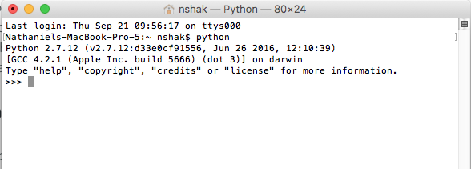
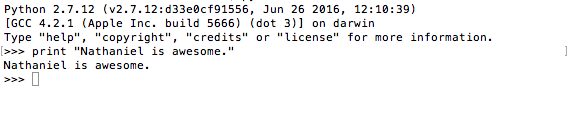

# Lesson 1: Some Housekeeping and Getting Started with Python  

**To start this lesson, students should**:

* Be computer proficient - be a decent typer, know how to navigate the computer, have experience regularly using a computer.
* Have experience coding in other languages.

**By completing this lesson, students will**:

* Get Python set up on your computer and be able to run Python files.
* Become familiar with the terminal (and feel like a complete hacker when using it - trust me, you'll see).
* Start to be familiar with Python and how it's different from other coding languages they may have used.

## Getting set up with Python

First things first! To start this class, we're going to need to set up Python on your computer. We will be using Python 2. This process will be different for Mac users and Windows users, so if you're using a Mac, go [here](macsetup.md), and if you're using a Windows computer, go [here](https://docs.google.com/document/d/e/2PACX-1vSMJNOaNphw0dD9h-pB3MlJLnpZOVP-ZtI4Hfe5J33QHwDrEWjKYEsX2Rv8UB0n6-8UfBrzehYUIjSe/pub), and follow the instructions. When you're done, come back here and we'll continue.

## Messing around with Python

We've already been introduced to our intimidating, but useful friend, the terminal (or command prompt for windows users). We've just set up Python, so now let's familiarize ourselves with it.

Python is a relatively new language, and its usage is growing rapidly. People use it to build websites (like Instagram!), games, and analyze data to understand how people use these websites and make them better. But rather than talk about it, let's just jump right in.

Open up your terminal or command prompt again, and just type in:

    python

and hit "enter".

You should see something like this:

This is the **Python Interactive Interpreter**. It lets you write Python code line by line and *see the immediate results*. Pretty cool, right?

First, go ahead and type this:

    print("Nathaniel is awesome.")

It should look something like this after you hit "enter":

Cool! You write the code, then below the code, you see the immediate output of that code. (If you're using Python 3, you will need parentheses around the words.)

Let's try some more. Here's a list of things to try. First, think to yourself what you expect will show up, then type it into the interpreter and hit "enter" to see if you were right. If you were wrong, don't worry about it! Feel free to **Google it** if you're curious why it happened the way it did. For the sake of time, I won't explain these just yet. They're just for you to start to get familiar with Python. Also, if the interpreter gives you an error on some of these, don't worry - that's meant to happen on some of them! If you want to get out of the interpreter and back to the regular terminal, just hit "ctrl-d" at any time. Also, once again, don't be afraid to mess around with it and try some stuff on your own.

1. `1 + 2`
2. `1 / 3`
3. `1.0 / 3`
4. `2*3`
4. `2**3`
6. `float(1)`
7. `1 == float(1)`
8. `1 is float(1)`
9. `string yolo = "swag"`
10. `yolo = "swag"`
11. `print(yolo`)
12. `meep = 400`
13. `meep / 3`
14. `type(meep)`
15. `type(yolo)`
16. `2 == 2 && True`
17. `2 == 2 and True`
18. `!False`
19. `not False`

Once you're done with that, go ahead and hit "quit()" to exit the interpreter. 

## Run a Python File

Okay, next we're going to write our first official Python program and run it. This will look a bit different for windows and mac users, so click [here](mac_hello_world.md) if you're using a Mac computer and [here](windows_hello_world.md) if you're using a Windows computer.

After that, you're done with lesson 1! On to [Lesson 2!](../Lesson2)
