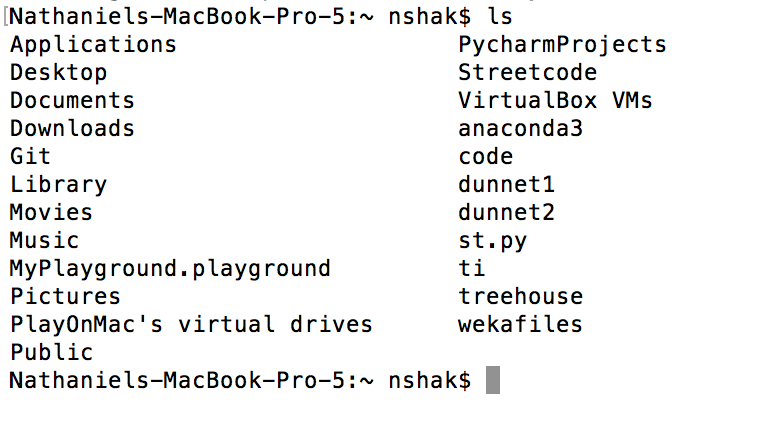
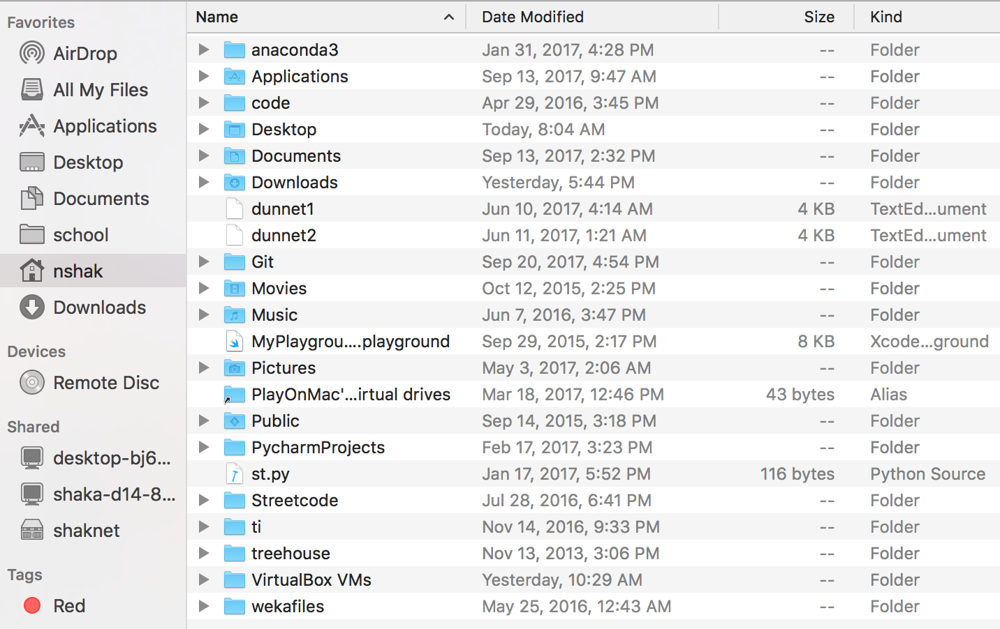
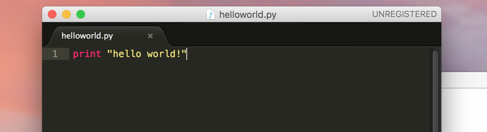
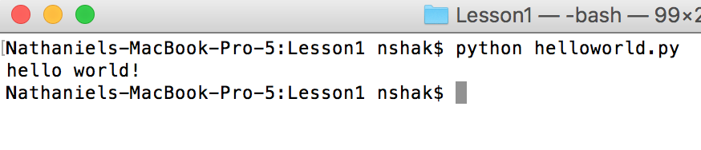

# Our First Python Program and Using the Terminal

Okay! You made it this far! Now, we get to write our first program in Python. Before we do that though, we need to get a bit more acquainted with our scary but useful friend, the terminal.

  
(This actually isn't at all what working with the terminal looks like. It's just what I felt like I was doing the first time I used it.)

## So, what is the terminal?

The first couple times I had to use the terminal, I thought of the movies where you see hackers frantically typing in their keyboard as green text frantically sprays up the screen over a black background and wondered if that was it was going to be like. Spoiler alert: it's not.  

Here is the dictionary definition of the terminal, according to dictionary.com:

> Any device for entering information into a computer or receiving information from it.  
 
That's a bit vague, but essentially all it is. It's a way of us interacting with the computer in a different way than clicking and scrolling through windows. In some ways, it's more limited and difficult to use, but in other ways, as you'll learn throughout this class, it makes things a lot easier, especially things involving programming.  

So let's go ahead and learn some of the basics.  

Type `ls` into the terminal and hit "enter".  

You should see something that looks like this:

*What just happened?*

`ls` stands for "list", and what you just did is list all the files of the directory you're currently in. That's another thing about the terminal. You always have a directory that you're in at any given point. To figure out what that is, you can use the command, `pwd`. This stands for "print work directory". After doing this, you should see similar to:

	/Users/nshak

And if you open up Finder and look in that same folder that you're in in the terminal, you should see matching folders and files to what was printed out by `ls`.  

Just to prove it to you, here's what that folder looks like for me in Finder:  

  

Now, to learn one of the most important terminal commands we'll be using. Go ahead and use this command:

	cd Documents
	
Now, type `ls`. Notice anything different? That's because we just entered the "Documents" folder. If you want to confirm that, go ahead and try the `pwd` command to confirm that. If you didn't already guess it, `cd` stands for "change directory". Should be pretty easy to remember, right?  

Another thing, if you ever want to go up a level in folders (out of the directory you're currently in), use this command:

	cd ..
	
Anyways, cool! You just learned a couple of the most important terminal commands for navigating around. Feel free to take some time using `cd` and `ls` and `pwd` to navigate all over the place while feeling like a [real hacker](http://geektyper.com/tegnio/).  

>Protip: if you ever want to quickly return to your "home" directory, you can just type `cd` with nothing after it, and it will take you there.

Here's a list of the commands we've learned so far, just so you remember:

Command  | Function
------------- | -------------
ls  | list files and directories
cd  | change directory
pwd | print working directory

> Protip: as you're in the middle of typing file and directory names, try pressing tab. This will caues the terminal to autocomplete what you're typing if you've typed enough letters for it to narrow down what you're typing. Pretty cool, right?

Once you're bored of cding and lsing around, it's time for

## Creating your First Python Program

Go ahead and navigate to your Documents folder (or whatever other folder you'd like to do this in). Now, type the following command:

	mkdir mycode
	
If you use `ls` again, you'll see that a folder called "mycode" now exists. That's because the `mkdir` command allows you to make a new directory. Go ahead and cd into that new folder you just created.

Now, we're going to need to install a program called Sublime Text 2 if you don't already have it on the computer. You can check if you have this installed already by typing in the terminal:

	which subl
	
If nothing shows up, we need to [install it](installsublmac.md). If it's already installed, you should see something like:

	/usr/local/bin/subl
	
Next, we're going to create our Python file. Use the following command to do so:

	subl helloworld.py
	
This should open an empty Sublime Text 2 window. We also need the `.py` to tell it that it's a python file. If you haven't used Sublime Text before, it's a text editor for your code. Think Microsoft Word, but for code. You'll come to appreciate it soon.

Alright, ready for our first Python program?

For this, all we're going to do is write one simple line of Python code in Sublime Text. Here it is:

	print "hello world!"
	
It should look like this:

	
After you type that, hit "command-s" to save. Make sure the circle on the tab turns to an "x" like you see in the picture. That means all your changes were saved.

*Okay, ready to run it?*

Go back to the terminal and run the following command:

	python helloworld.py
	
This is how we run Python files. You should see the following:

Congrats, you just wrote your first program! That's all for this lesson!