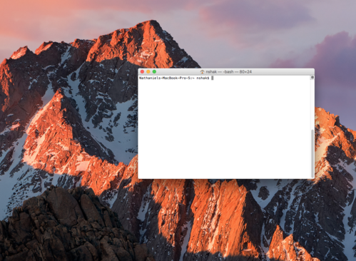

# Setting up Python 2 on Mac

This tutorial is honestly just going to be a bunch following instructions. In the process of this, you will get introduced to **the terminal**, a mysterious and scary being that every young coder will one day encounter. As you go through this tutorial, *don't be afraid to mess around with things for the heck of it*. If you're curious about something that I didn't explain well, **Google it**! As you will soon learn, a large portion of coding is learned through Googling and messing with things. *Anyways, let's get started!*

* **Open the terminal**. You should be able to find it by just pressing "command-space" and typing in "terminal". One you have it open, it should look something like this:

*What is that?!*  

Yes I know, it looks scary. I remember feeling a mixture of extreme fear and the feeling that I was doing some hardcore hacking of a government system or something the first time I used the terminal. I'll explain more about what this is later. In the meantime, see what happens if you hit "command-i" and mess around if you want to feel even more like a hacker.

* **Check your Python version**. Okay, I know the terminal looks really scary, but you can do it! By the end of this class, you and the terminal will be good friends. Type the following into the terminal:  

        python --version
        
Then hit "enter".
	
It should either say something like:

	Python 2.x.xx
	
(where the x's are numbers) or:

	-bash: python: command not found
	
In the first case, it means you already have Python 2 on your computer. **That means we're good, and you can actually [continue on with the lesson](README.md)**. In the second case, we don't have Python set up yet, so let's do that.  

This is unlikely, but if, by chance, you see something like this:

	Python 3.x.xx
	
That means you have Python 3 set up instead of 2, in which case you should either talk to a mentor to change it to 2 (which will be a bit more complicated) or just go on with it. There are some minor syntactical differences between 2 and 3 (mostly the "print" statements), but most of the changes won't be super noticeable.  

*Okay, let's continue*.

<!--
TODO: do they have to install ruby first here?
-->

* **Install Homebrew**. You don't really need to know what this is, but if you're curious, it's software that helps us easily install and manage other software.  

*Okay, ready to really feel like a real hacker?*

Go ahead and copy/paste the following into the terminal:

	/usr/bin/ruby -e "$(curl -fsSL https://raw.githubusercontent.com/Homebrew/install/master/install)"

then press "enter".  

*Whoaaa, that looks crazy right?*  

Go ahead and wait for the terminal to stop spitting out random text, then we can continue to the next step.

* **Install Xcode Command Line Tools**. You don't need to know what this is. Pretty much, we need it for Python to work.  

You know the drill now, just paste this into the terminal:

	xcode-select --install
	
and hit "enter" again.

If it says something like:

	xcode-select: error: command line tools are already installed, use "Software Update" to install updates
	
Don't worry about it. Just continue. Otherwise, click through the next couple dialogue boxes and install the software.

*Okay, we're almost there*.

* **Install Python**. More typing things we don't understand into the terminal. Yaaay. You know the drill. Put this in the terminal and hit "enter":  

		brew install python
		
Okay, after the terminal starts going crazy from that last command, you should be good. You can check to see if it all worked by typing:

	python --version
	
in the terminal and pressing "enter". If the following shows up:

	Python 2.x.xx
	
You're good! Go ahead and [continue with the lesson](README.md). If not, check with a mentor.