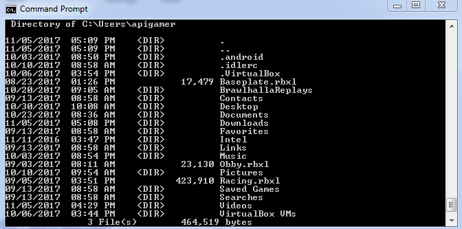
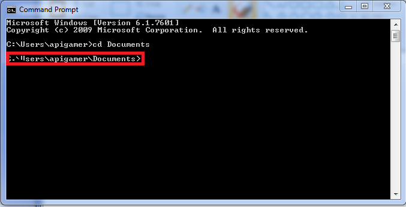
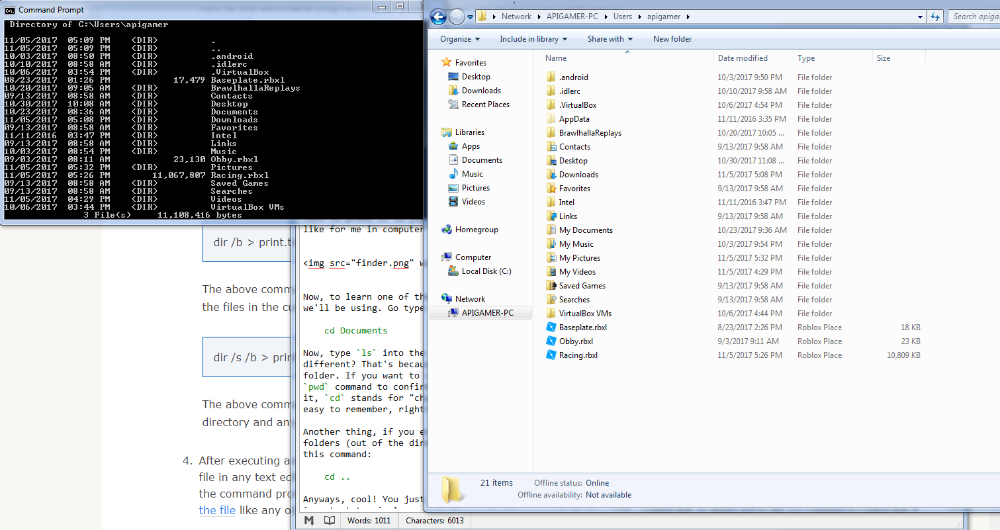
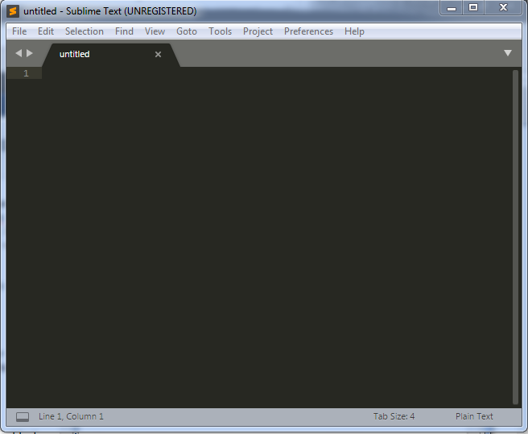
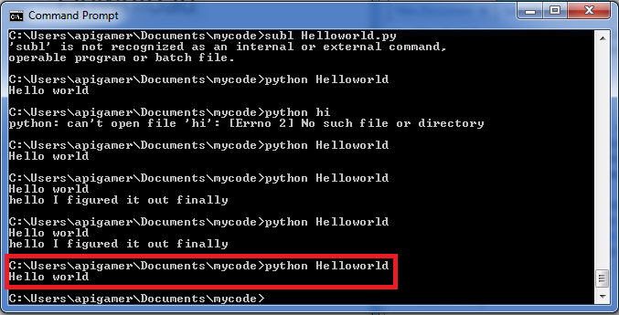

# Our First Python Program and Using the Command Prompt

Okay! You made it this far! Now, we get to write our first program in Python. Before we do that though, we need to get a bit more acquainted with our scary but useful friend, the command prompt.

> (This actually isn't at all what working with the command prompt looks like. It's just what it feels like the first couple times you use it.)

## So, what is the command prompt?

The first couple times I had to use the command prompt, I thought of the movies where you see hackers frantically typing in their keyboard as green text frantically sprays up the screen over a black background and wondered if that was it was going to be like. Spoiler alert: it's not.

Here is a dictionary definition of the command prompt, according to dictionary.com:

> Any device for entering information into a computer or receiving information from it.
 
That's a bit vague, but that's essentially all it is. It's a way of us interacting with the computer in a different way than clicking and scrolling through windows. In some ways, it's more limited and difficult to use, but in other ways, as you'll learn throughout this class, it makes things a lot easier and gives us much more capabilities, especially for programming.

So let's go ahead and learn some of the basics.

Type `dir` into the command prompt and hit "enter".

You should see something that looks like this:

*What just happened?*

`dir` stands for "directory", and what you just did is list all the files of the directory you're currently in. On the top of the listed directory it will tell you the path you took and which directory you are currently in. It will look something like this:

And if you open up the Computer window and look in that same folder that you're in in the command prompt, you should see the same folders and files that were printed out by `dir`. The command prompt is actually a lot like a text version of the Computer window in many ways, if that makes it easier to think about.

Just to prove it to you, here's what that folder looks like for me in the Computer window:

Now, to learn one of the most important terminal commands we'll be using. Go type this command into the command prompt:

    cd documents

Now we are in the "Documents" folder. If you want to confirm that, look next to where you enter your commands. The last folder name listed next to the `>` is the current directory you're in.

Another thing: if you ever want to go up a level of folders (out of the directory you're currently in), use this command:

    cd ..

You just learned a couple of the most important terminal commands for navigating around. Feel free to take some time using `cd` and `dir` to navigate all over the place while feeling like a [real hacker](http://geektyper.com/tegnio/).

> Pro tip: if you are really deep into a directory structure, you can jump out of multiple directories in one line. `cd ..\` goes up one level, `cd ..\..\` goes up two levels, etc.

Here's a list of the commands we've learned so far, just so you remember:

* `dir` - list files and directories
* `cd` - change directory

> Protip: as you're in the middle of typing file and directory names, try pressing tab. This will cause the command prompt to autocomplete what you're typing if you've typed enough letters for it to narrow down what you're typing.

Once you're bored of `cd`ing and `dir`ing around, it's time for...

## Creating your First Python Program

Go ahead and navigate to your Documents folder (or whatever other folder you'd like to do this in). Now, type the following command:

    mkdir mycode

If you use `dir` again, you'll see that a folder called "mycode" now exists. That's because the `mkdir` command just created it. Go ahead and `cd` into that new folder you just created.

Now, we're going to need to install a program called Sublime Text 3. Use [this link](https://www.sublimetext.com/3) and download the Windows version. After you finish installing Sublime Text 3, you should get a window like this.

In the editor, type in `print "Hello world"` then go to the top left of the window and click Save As. Navigate your way into the directory you just made in the Documents folder and save it as `helloworld.py`.
    
From there, go back to the command prompt and find your way into that same directory. once inside that directory type `python helloworld.py` and it should output something like this:

This means the computer ran your program, and you're seeing the output of that program. Congrats, you just wrote your first Python program! That's all for this lesson!

[Click here to move on to Lesson 2](../Lesson2)