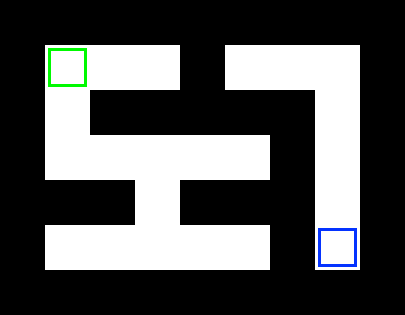

# Lesson 10: More recursion

**To start this lesson, students should**:

* Understand the basic principles of recursion (base cases, recursive calls).
* Have some experience writing basic recursive algorithms (factorial, flood fill).

**By completing this lesson, students will**:

* Gain more practice writing recursive functions.
* Understand backtracking and state-passing in recursive algorithms.

All of the exercises in this lesson are in exercises.py. Open it up and let's get started!

## 1. Find a file

You're already familiar with files and folders (directories). For this question, write a function that checks if a file with a given name exists in a given directory or any directory that it contains. There are some example files and directories in this directory; you can use these to test. For example:

    file_exists('README.md') -> True
    file_exists('you_found_it.txt') -> True
    file_exists('not_a_real_file.txt') -> False

When dealing with files and directories in code, directory names are separated by slashes. So the string `'code/Lesson10/exercises.py'` refers to exercises.py in the Lesson10 directory, which is in the code directory.

You can use the `os.listdir` function to list the contents of a directory. You can use the `os.path.isdir` function to check if a given item is a directory or a regular file. See the [Python documentation](https://docs.python.org/3/library/os.html) for more information on these functions.

> Hint: Your base case should be when the item you're looking at *is not* a directory.

## 2. Choosing sums

Given a list of integers and a target integer, is it possible to choose a group of them (or possibly none of them) so that the group sums to that target? For example:

    sum_to_target([2, 4, 8], 10) -> True (2 + 8)
    sum_to_target([2, 4, 8], 14) -> True (2 + 4 + 8)
    sum_to_target([2, 4, 8], 9) -> False (there are no odd numbers in the list)
    sum_to_target([2, 4, 8], 0) -> True (don't choose any of them)

One common way to write recursive functions goes like this:
1. Figure out what your base cases are, and write them first.
2. Figure out what the recursive calls should be, and write them as if your function already works perfectly.
(This is what we did with the zombies problem in lesson 9, remember? First we dealt with the current being - checking if it's human or not, and turning it into a zombie if needed, then we dealt with the neighbors.)

In this problem, there are two base cases - one for when the numbers array is empty, and one for when the target value is zero. It might help to write the code for these first, before breaking down the problem into recursive calls.

After your base cases are written, it's time to deal with all the other cases. One way to break down the problem is to consider each item individually. For each item, either you'll choose it or you won't. So there are two smaller problems that need to be solved:
* Can we hit the target using the items in the rest of the list assuming we *don't* choose the first item?
* Can we hit `(target - first_item)` using the items in the rest of the list assuming we *do* choose the first item?
Each of these smaller problems should be one recursive call in your function.

Write your answer in `sum_to_target` in your Python file. 

> Hint: `numbers[1:]` is a copy of `numbers` with the first item removed.

### Challenge

Write the `sum_to_target_challenge` function so that it returns the numbers that sum to the target, or None if there's no group that sums to the target (instead of just True or False).

For example:

    sum_to_target_challenge([2, 4, 8], 10) -> [2, 8]
    sum_to_target_challenge([2, 4, 8], 14) -> [2, 4, 8]
    sum_to_target_challenge([2, 4, 8], 9) -> None
    sum_to_target_challenge([2, 4, 8], 0) -> []

> Hint: You'll have to modify the value that the recursive call returns. It might be easier to come back to this question after finishing the rest of the lesson.

## 3. Generating subsets

Write the `subsets_of_size` function so that it returns all possible ways of choosing a given number of items from a list.

For example:

    subsets_of_size([1, 2, 3, 4], 0) -> [[]]
    subsets_of_size([1, 2, 3, 4], 1) -> [[1], [2], [3], [4]]
    subsets_of_size([1, 2, 3, 4], 2) -> [[1, 2], [1, 3], [1, 4], [2, 3], [2, 4], [3, 4]]
    subsets_of_size([1, 2, 3, 4], 3) -> [[1, 2, 3], [1, 2, 4], [1, 3, 4], [2, 3, 4]]
    subsets_of_size([1, 2, 3, 4], 4) -> [[1, 2, 3, 4]]
    subsets_of_size([1, 2, 3, 4], 5) -> []  (there's no way to choose 5 items from 4)

First, figure out your base cases.
* What should we return if `count` is zero?
* What should we return if `items` is empty?

Second, figure out your recursive calls. You can break this problem down like the problem in part 2 by considering the first item in the list.
* Assume we **don't** choose the first item in the list. What are all possible ways of choosing `count` items from the rest of the list?
* Assume we **do** choose the first item in the list. What are all possible ways of choosing `count - 1` items from the rest of the list?
Each of these smaller problems should be one recursive call in your function.

> Hint: For the first recursive call (when you do choose the first item), don't forget to add that item to each of the lists returned by the recursive call.

## 4. Maze solving

Write the `solve_maze` function that checks if a maze is solvable. This isn't as hard as it sounds! Remember how the flood-fill algorithm from lesson 9 covers the entire area of a contiguous 2-dimensional space? You can modify the flood-fill algorithm to solve a maze.

Specifically, your function should take a maze and return True if the goal is reachable from the start, and False if it isn't. For this question, we'll use a new type of variable - a *class instance object*. We'll talk about classes in detail in the next lesson. For now, just use these functions to work with the maze:
* `maze.is_wall(x, y)` checks if a cell is a wall or not
* `maze.mark_visited(x, y)` marks a cell as visited
* `maze.was_visited(x, y)` checks if a cell was visited already
* `maze.print_field()` prints the maze to the terminal (useful for debugging)
* `maze.print_visited()` prints which cells in the maze are visited (useful for debugging)

Like all the recursion questions above, figure out your base cases first:
* What should we do if the cell is a wall?
* What should we do if the cell has already been visited?
* What should we do if the cell is the goal cell?
To put this in the same context as the flood fill exercise from lesson 9, you can think of walls as cats, cells you've already visited as zombies, and cells you haven't yet visited as humans.

Second, figure our your recursive calls. This should be very similar to flood fill - you should look in all four directions from the current cell.

For this maze, your function should return True:

For this maze, your function should return False:

### Challenge

Write the `solve_maze_challenge` function so that it returns the path to the goal, or None if the maze is not solvable. Specifically, it should return a list of strings saying which directions to move. For this maze, your function should return `['down', 'down', 'right', 'right', 'right', 'right', 'up' ,'up', 'right', 'right', 'down', 'down', 'down', 'down']`:

The function you'll write in this section should be similar to `solve_maze`. The base cases and recursive calls are actually the same - you just need to change the return values to return the path instead of only `True` or `False`.

When writing the recursive call, it might help to assume that it correctly solves the subproblem, then modify the return value to be the solution of the main problem.

For example, suppose you recursively call `solve_maze_challenge` on the cell below the current cell (the cell at `(x, y + 1)`) and it returns a list (not None), which means that that list is the path that would take you from the cell at `(x, y + 1)` to the goal. The solution to the maze, then, is to move down from the current cell, then follow the path that the recursive call returned. In Python, you can add something to the beginning of a list by adding two lists together - for example, `['down'] + x` is a copy of the list `x` with `'down'` added to the beginning.

> Hint: Don't forget to check if the recursive call's return value is None before modifying and returning it.

## 5. Bonus: Non-intuitive recursion (Tower of Hanoi)

This isn't a question, but it's a puzzle that you might find interesting. We'll give the solution after describing the puzzle.

The Tower of Hanoi is a puzzle game. There are three pegs, and some disks on the pegs, and the goal is to move all of the disks from the left peg to the right peg. But you can only move one disk at a time, and you can't put a larger disk on top of a smaller one. The solution can be pretty complex - here's one way to solve the puzzle for 4 disks:

Looks pretty complicated... but it turns out this game has a *surprisingly simple recursive solution*. If you represent the towers as lists in Python, the solution is:

    def move(n, source, target, extra):
        if n == 0:
            return
        move(n - 1, source, extra, target)
        target.append(source.pop())
        move(n - 1, extra, target, source)

What's going on here? We can break it down like this:

    # this function moves n disks from the source list to the target list, using
    # the extra list for storage space.
    def move(n, source, target, extra):
        # if we're supposed to move zero disks, do nothing (base case)
        if n == 0:
            return

        # move all the disks on top of the n'th disk to the extra list
        move(n - 1, source, extra, target)

        # now the n'th disk is at the top (end) of the source list - take it off
        # and move it to the target list
        target.append(source.pop())

        # move all of the disks from the extra list back on top of the disk we
        # just moved
        move(n - 1, extra, target, source)

Like the Tower of Hanoi, a surprising number of problems can be solved by breaking them down into smaller problems and solving those, which is often much easier than solving the problem all at once. See the next section for more examples of useful and popular recursive algorithms.

## 6. More examples

Wanna see more recursion? Here are some examples of useful or interesting recursive algorithms.

* [Towers of Hanoi](https://en.wikipedia.org/wiki/Tower_of_Hanoi) (described in more detail).
* [Quicksort](http://en.wikipedia.org/wiki/Quicksort) is one of the fastest sorting algorithms, and is used in almost every programming language. It works by separating the array into two parts, one with low values and one with high values, then recursively sorting each half. This is a good example of a "divide-and-conquer" solution to a standard problem (sorting).
* [Binary search](https://en.wikipedia.org/wiki/Binary_search_algorithm) is a fast way to find an item in a sorted array. On a 1-million item list, a standard (linear) search can take up to 1 million comparisons to find a specific item, but a binary search will use no more than 10 comparisons.

In the next lesson, we'll introduce classes, a powerful concept for organizing your code and making large projects easy to manage. See you then!