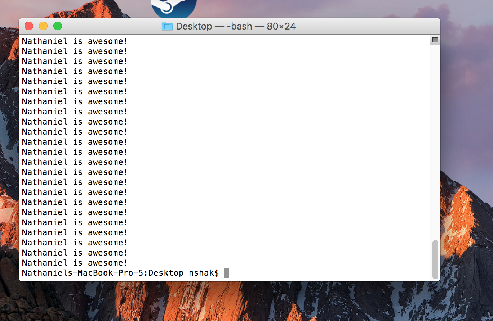

# Lesson 2: Getting Familiar with Python

**To start this lesson, students should**:

* Have Python and Sublime Text 2 set up on their computer.
* Be familiar with the terminal/command prompt, how to navigate around with it, and how to run Python files from it.
* Have a basic understanding of variables, control flow, and functions (it's okay if it's in different languages).
* Have experience putting together the concepts above to form coherent programs.

**By completing this lesson, students will**:

* Gain an understanding of variables, functions, and control flow statements in Python and how they work in Python as opposed to other languages.
* Get practice using control flow to write programs that follow a logical flow in Python.
* Be able to construct basic programs in Python and run them.

Before I start this lesson, let me make sure you know that as I write this lesson, I'm assuming that you have already done a fair share of basic programming. This means that I may go through a couple of concepts fairly quickly without slowing down to explain them.  

## Some Python Basics

Before we start doing any coding, I want you to look at the following block of Python code:

	a = 0
	while a < 20:
		a = a + 2
		if a == 12:
			print "I'm skipping this number because I don't like it."
		else:
			print a

You might have seen this code already if you were reading the course requirements of this class, but let's take a closer look at it. Now, even if you haven't coded in Python before, you might still be able to tell roughly what the code is doing and what it will print out. Feel free to paste all this code into the helloworld.py file from the last lesson and run the file again in the terminal (using `python helloworld.py`) to see for sure what prints from it.  

Now, even though you might have been able to tell what was going to print out, you might have also noticed that there are some weird differences between this code and other languages you may have used in the past. 

Let's look at a couple of them.

### Variables

If you've coded in most other languages besides python, this line probably looks pretty weird to you.

	a = 0
	
No, this isn't the middle of the program where `a` has already been defined earlier. This is actually just how you define variables in Python. You might be thinking: "shouldn't it look something like this?":

	int a = 0
	
Well, yes, if we're using Java or most other languages, but Python is what people call **dynamically typed**. Pretty much, this means that Python is able to figure out what type of variable each variable is without you ever having to say so in the code. In fact, if I wanted to, I could even do something like this:

	a = 0
	a = "yolo swag"
	a = False

*and the code would still work*. Pretty cool, huh?

### Control Flow

> If you haven't heard the term, "control flow" before, it's pretty much a general term for understanding while loops, if/else statements, for loops, and how they all fit together to determine the order that the code will run in.
 
#### Conditionals

Looking at these parts of the code:

	while a < 20:
	...
		if a == 12:
	
You'll probably notice something very quickly. *No parentheses!* Yes, in Python, we don't need parentheses for our if or while loops. We just need the **condition** (the part of the statement that's either true or false) and a colon.

#### Indentation

The other thing you might notice is the lack of brackets for our while, if, and else statements. If you've used other languages, you'd probably be used to seeing something more like this:

	a = 0
	while a < 20:{
		a = a + 2
		if a == 12:{
			print "I'm skipping this number because I don't like it."
		} else: {
			print a
		}
	}
	
> (this code doesn't work, by the way).
 
The reason for the lack of brackets is that **Python relies on indentation instead of brackets** to figure out what code belongs to which statement.  

For example, 

	a = 0
	while a < 20:
	
the above lines of code are not indented at all because they are not inside of any statements. On the other hand, these lines:

		a = a + 2
		if a == 12:
		
are indented once since they are inside of the while loop, but not any other statements. Since they are inside of **1** statement, they are indented **1** time. On the other hand, this line of code:

			print "I'm skipping this number because I don't like it."

is indented **2** times since it is inside both the while loop and if statement. The extra indentation kind of serves as a replacement for the opening bracket that would have come after the if statement. Likewise, the following line:

		else:

is indented only **1** time, meaning that it is only inside the while loop, not the if statement, and it, in a similar way, serves as a replacement for the closing bracket that would have come before the else statement. **Therefore, it signifies the end of the if statement**.

The next line:

			print a

if you haven't guessed already, is indented 2 times since it is inside both the while loop and the else statement.

#### For Loops

I saved introducing for loops until now since they're much different than for loops in other languages. Here's an example of code you can try running:

	for i in range(10):
		print i
		
Now this looks a fair bit different from for loops in most other languages. Here's the Java equivalent of the above statement:

	for(int i = 0; i < 10; i++){
		System.out.println(i);
	}
	
When you run the code, you'll see that, like the Java code above, it will print the numbers 0-9. This is because the `range(10)` function defines that the for loop will go up to **but not including** the number in the parentheses, 10, running pretty much the same way a regular for loop runs.

### Readability

One of the biggest differences in Python compared to other languages is its *readability* - pretty much, it looks more similar to English than any other coding language out there. Even looking at the above code for the for a Python for loop versus the Java one, you can tell that someone who has never coded before would be much more likely to understand the Python one. That was very intentional and a big reason why Python is growing so much. It's also a big reason why we're using it in this class.

## Let's get started with some coding

Okay, for the part that many of you have been waiting for. Let's get into some coding. Remember what we did last lesson when we created a Python file? We're going to do that again now and write our code there. 

Just to remind you if you forgot how: go ahead and open up the terminal again and navigate to a folder where you want to write some code using `cd`. Once you're in a folder where you'd like to write some code, type `subl tictactoe.py` in the terminal. This will open up Sublime Text and create a file called "lesson2ex1.py" for you to write your code in.

> Remember, the way to use cd is to type: `cd foldername` where foldername is the folder you'd like to change into. You can use `cd ..` to go out of the folder you're currently in. 

### Tic Tac Toe

Now, we're going to try our first exercise.  

In your tictactoe.py file, write code to print out a Tic Tac Toe board that looks like this:

	  |  |
	--------
	  |  |
	--------
	  |  |  

> **Hint**: to print things in Python, use the `print` function.  
> ex: `print "yolo"`
 
Once you're ready to test your code, we're going to go ahead and run our tictactoe.py program the same way we ran our tictactoe.py program in the last lesson.  

Just to review, go to the terminal and make sure you're in the same directory that tictactoe.py is in.

> **Reminder**: use `ls` to list the files in your current directory and `pwd` to list the current directory you're in.
 
Make sure you saved your sublime text file ("command-s"). Then type the following command:

	python tictactoe.py
	
You should see the output of our code (or potentially an error). If it didn't work exactly how you wanted, go ahead and repeat this process until you've got it.

### I'm Awesome x 100

Once you're done with that, we can move on to the next exercise. Create another file called imawesome.py using the same steps we used in the above exercise, then do the following:

Write a program that prints out "\*your name\* is awesome!" 100 times. Then run it the same way we ran the last program (remember to save first!) Here's an example of what my program looked like when I ran it:

> **Hint**: Try using a for loop. (Look at the code earlier in this lesson for a good example.)  
> **Challenge**: If you used a for loop, try doing this again with a while loop.

### Even Odd

Great job! You know the drill now - make a new file (you can call it whatever you want) and try the next problem:

Write a program that prints out the numbers 0 through 30 followed by whether that number is even or odd. Here's what the output should look like:

	0
	even
	1
	odd
	2
	even

	...

	28
	even
	29
	odd
	30
	even
	
	
> **Hints:**
> For loops will be useful again here.  
> **Your code should not involve over 5 lines of print statements**.  
> If you're thinking about how you could figure out if a number is even or odd, try the mod operator (%). This operator gives the remainder of one number divided by another. EX: 6 % 2 = 0, 7 % 2 = 1.  

### Even Odd Part 2

This next one is very similar to the last exercise, but a bit different. 

This time, we will print numbers from 0-66 followed by if the number is even or odd but have the number increase by 3 each time instead of 1. I know there's ways to do this with a for loop, but for the sake of this exercise, try it with a while loop. Here's an example of what your output should look like:

	0
	even
	3
	odd
	6
	even
	
	...
	
	60
	even
	63
	odd
	66
	even

> **Hint:** Looking at the code sample I gave in the very beggining of the lesson might be helpful here.
 

### Fizzbuzz

Okay, this next one might be a bit tricky. Here's what we're going to do:  

Write a program that prints the numbers 0 to 100. However, on the numbers that are divisible by 3, print "fizz" instead. On numbers that are divisible by 5, print "buzz" instead. on numbers that are divisible by 3 **and** 5 print "fizzbuzz". Here's what your output should look like:

	fizzbuzz
	1
	2
	fizz
	4
	buzz
	fizz
	7
	8
	fizz
	buzz
	11
	fizz
	
	...
	
	88
	89
	fizzbuzz
	91
	92
	fizz
	94
	buzz
	fizz
	97
	98
	fizz
	buzz
	
**Hint:** Think about how "if, else if, and else" statements might be useful here. Below is an example of what these statements look like in Python. In Python "elif" is used instead of "else if".

	if num == 3:
		print "eww it's a 3"
	elif num == 42:
		print "YES! it's my favorite number! 42 for the win!!!"
	else:
		print "meh, this number is okay."
		
> Assume the variable, `num` has been defined earlier in the program.
 
## Functions

Cool, we're almost done. There's one last concept for us to get through in this lesson, and that's functions. I'm going to assume that if you're doing this lesson, you've already worked with functions, parameters, and return types in the past in at least some other language so I'll skip the explanation of what they are.

> If you do need an explanation/review of what functions and parameters are, go [here](https://www.learnpython.org/en/Functions).
 
Here's an example of what a function with parameters looks like in Python:

	def count_up(num):
		for i in range(num):
			print i
		print "all done!"
		
Once I define the function like this, I can **call** this function using the following code:

	count_up(5)
	
which would have the following output:

	0
	1
	2
	3
	4
	all done!
	
Notice that I didn't have to define a return type in the function. In Python, it automatically figures it out for you. I could also write a function like this:

	def sum(a, b):
		return a + b
		
> Yes, I know it would make much more sense to just use addition. This is just an example.

then call it like this:

	mysum = sum(23, 54)
	print mysum
	
and then the output would be:
	
	77
	
### Making Fizzbuzz a Function
	
Okay, last exercise. 

Go back to the code you wrote for fizzbuzz. Change it so that you use that code in a function called "fizzbuzz" that takes in a parameter that can specify what number fizzbuzz will go up to. After writing this function, you should be able call the fizzbuzz function like this:

	fizzbuzz(16)
	
and the output should look like this:

	fizzbuzz
	1
	2
	fizz
	4
	buzz
	fizz
	7
	8
	fizz
	buzz
	11
	fizz
	13
	14
	fizzbuzz
	16
	
or like this:

	fizzbuzz(3)
	
and the output would look like this:

	fizzbuzz
	1
	2
	fizz	
	
> **Hint**: Remeber range(n) will go up to, **but not including** the number n
 
After you finish that, you're done with Lesson 2! Good job! 

[On to lesson 3](../Lesson3)
