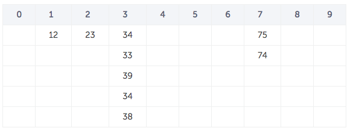

# The Big O Runtime of Bucket Sort with Selection Sort is...

# O(n2)

### Wait, what?

This might be confusing at first. With us doing so much work to partition buckets before doing selection sort, wouldn't we expect an improvement in our Big O runtime?

To answer this, we need to take a step back to **what Big O runtime defines** in the first place again.

Remember, the Big O runtime gives us the **worst case** runtime with respect to input size.

When we use a sorting algorithm, we don't always know exactly what the contents of the list to be sorted will be before we sort them. Therefore, we can ask the question:

### What if all the elements in the list end up in the same bucket?

More concretely, if we go back to this image from the explanation on the webpage of the buckets after we initially assign each number into a bucket, imagine if all the numbers happened to be between 30 and 39?

Well, then all the numbers would be in bucket 3, and we'd perform selection sort on that bucket. Then, the runtime of that would be...

**O(n2) once again!**

So, if using bucket sort doesn't improve the Big O runtime of the sorting algortihm we use on each bucket, then we have to ask...

## Why is this algorithm useful at all?

The key to this question lies in the definition of Big O runtime, namely, that Big O runtime only measures runtime in the **worst case**. On average, though, will this algorithm improve runtime?

**Most definitely.**

If we assumed that all of our **n** elements were always partitioned evenly into **k** buckets, then we would run selection sort **k** times, but each time, we would only have to sort **n/k** items. So the overall runtime would be:

**k * (n/k)2**

Which is the same as:

**n2/k**

If we have even 10 buckets, a 10x speedup is a *huge* increase in speed.

### But is it realistic to assume this?

Well, the answer is that **it depends**. Sometimes, we know a bit about the data we'll be sorting before we sort it.

If we know beforehand that it will be pretty evenly distributed, then we can assume good results.

However, if the data always tends to be clumped together, we know that the bucket sizes will be bigger, making the algorithm **less efficient**. In this case, we might choose a different sorting algorithm instead.

## Space vs Time

Another thing you may be wondering is: If the runtime is roughly

**n2/k**

when we have even distribution, why shouldn't we just make our **k** as big as possible?

One reason for that is that the larger the **k**, the more **memory** our algorithm will take up. Having that many buckets takes space!

However, on the flip side, the lower our **k**, the slower our algorithm will be. This brings up an important theme in computer science:

**We often have to balance the tradeoff between how much space we use in memory and how long our algorithms will take to complete**.

Anyways, that was a lot of information - definitely find a mentor to run through some of this if there were parts you didn't fully understand. Once you feel good about that, it's on to [lesson 8](../Lesson8)!